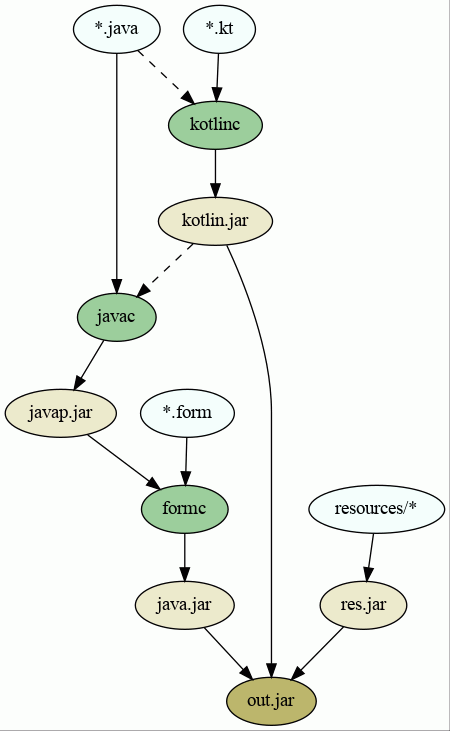

Implementation of the `iml_module` rule
---
The `iml_module` Bazel rule is relatively complicated, because it has to combine
several tools: `javac`, `kotlinc`, `formc`, etc.

Here is a graph showing how these tools are connected in the build graph when
building a single iml module. Note that dashed lines represent inputs that are
used as compile-time dependencies, but are not themselves transformed at the
given build step.



To modify this image, edit [assets/iml-module-build-graph.dot](assets/iml-module-build-graph.dot).
Then run the following Graphviz command from within `//tools/base/bazel/docs`.
```bash
dot -Tpng:cairo:gd assets/iml-module-build-graph.dot -o assets/iml-module-build-graph.png
```
